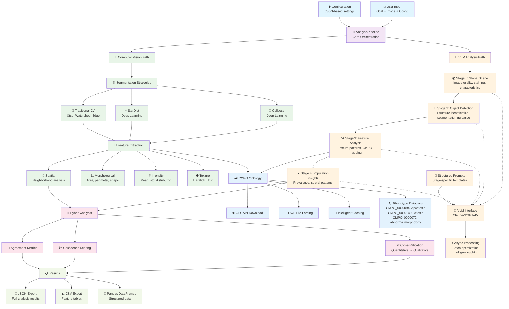

# Anton - Advanced Microscopy Analysis Tool

Anton is a sophisticated microscopy image analysis tool that combines traditional computer vision techniques with Vision Language Models (VLM) for comprehensive cellular phenotype analysis.

## Features

- **Hybrid Analysis Pipeline**
  - Quantitative analysis using traditional computer vision
  - Qualitative analysis using Vision Language Models
  - CMPO (Cellular Microscopy Phenotype Ontology) integration
  - Cross-validation between quantitative and qualitative results

- **Segmentation Capabilities**
  - Multiple segmentation strategies:
    - Traditional (Otsu, Watershed)
    - Deep Learning (Cellpose, StarDist)
  - Configurable segmentation parameters
  - Region-based analysis

- **Feature Extraction**
  - Morphological features (area, perimeter, eccentricity, etc.)
  - Intensity-based features (mean, std, min, max, etc.)
  - Texture analysis (Haralick features, LBP)
  - Spatial relationships (neighborhood analysis)
  - Population-level insights

- **CMPO Integration**
  - Automatic phenotype mapping
  - Ontology-based validation
  - Confidence scoring
  - Export capabilities (CSV, JSON)

## Architecture Overview



## Project Structure

```
anton/
├── analysis/
│   ├── quantitative.py  # Traditional CV analysis with multiple segmentation methods
│   └── qualitative.py   # VLM-driven analysis with feature extraction
├── cmpo/
│   ├── ontology.py      # CMPO ontology management and lookup
│   └── mapping.py       # Phenotype mapping and validation
├── vlm/
│   └── interface.py     # VLM integration for qualitative analysis
├── core/
│   ├── pipeline.py      # Main analysis pipeline orchestration
│   └── config.py        # Configuration management
├── utils/              # Utility functions
└── examples/           # Usage examples
```

## Installation

1. Clone the repository:
```bash
git clone https://github.com/pskeshu/anton.git
cd anton
```

2. Install dependencies:
```bash
pip install -r requirements.txt
```

## Usage

Basic usage example:

```python
from anton.core.pipeline import AntonPipeline
from anton.vlm.interface import VLMInterface

# Initialize components
vlm = VLMInterface()
pipeline = AntonPipeline(vlm, config={})

# Run analysis
results = await pipeline.analyze_image("path/to/image.tif", "detect_cell_death")
```

### Quantitative Analysis

```python
from anton.analysis.quantitative import QuantitativeAnalyzer

# Initialize analyzer with specific segmentation method
analyzer = QuantitativeAnalyzer(config={
    'segmentation_method': 'cellpose'
})

# Extract features
features = analyzer.extract_quantitative_features(
    image_path="path/to/image.tif",
    channels=[0, 1]
)
```

### Qualitative Analysis

```python
from anton.analysis.qualitative import QualitativeAnalyzer
from anton.cmpo.ontology import CMPOOntology

# Initialize components
ontology = CMPOOntology()
analyzer = QualitativeAnalyzer(vlm_interface, ontology)

# Extract qualitative features
features = await analyzer.extract_qualitative_features(
    image_path="path/to/image.tif",
    regions=quantitative_results['regions'],
    config={'batch_size': 10}
)
```

## Configuration

The analysis pipeline can be configured through the `config` parameter:

```python
config = {
    'segmentation': {
        'method': 'cellpose',  # or 'stardist', 'threshold', 'watershed'
        'parameters': {
            'batch_size': 8,
            'diameter': 30
        }
    },
    'analysis': {
        'channels': [0, 1],
        'batch_size': 10,
        'confidence_threshold': 0.5
    },
    'cmpo': {
        'ontology_path': 'data/cmpo.json',
        'cache_path': 'data/cmpo_cache.pkl'
    }
}
```

## Contributing

Contributions are welcome! Please feel free to submit a Pull Request.

## License

This project is licensed under the MIT License - see the LICENSE file for details.
