# Anton - AI-Powered Microscopy Phenotype Analysis Framework

Anton is a sophisticated microscopy image analysis tool that combines traditional computer vision techniques with Vision Language Models (VLM) for comprehensive cellular phenotype analysis.

## 🚀 Quick Start / Demo

**Want to see Anton in action right now?** Choose your demo:

### 30-Second Quick Demo
```bash
# Activate virtual environment
source venv/bin/activate

# Run quick demo (30 seconds)
python quick_demo.py
```

### Full Interactive Demo  
```bash
# Activate virtual environment
source venv/bin/activate

# Run comprehensive demo (2-3 minutes)
python demo.py
```

### Streamlit Web Interface
```bash
# Launch interactive web UI
streamlit run anton_simple_ui.py
```
**What you'll see:** Web interface with image upload, zoom controls, real-time VLM analysis, and CMPO phenotype classification.

### Test Suite
```bash
# Run all tests to verify functionality
python tests/run_tests.py
```

### CMPO Mapping Demo
```bash
# Explore CMPO ontology integration
cd anton/cmpo
python examples.py

# Or from project root:
python -m anton.cmpo.examples
```
**What you'll see:** Advanced semantic mapping of biological descriptions to standardized CMPO terms with biological accuracy validation.

**What you'll see:** Anton analyzing a real fluorescence microscopy image through its 4-stage pipeline:
1. 🔍 **Global Scene Understanding** (VLM analyzes overall image quality and content)
2. 🎯 **Object Detection & Segmentation Guidance** (VLM identifies structures and suggests methods)  
3. 🧬 **Feature-Level Analysis** (Detailed analysis of detected objects)
4. 📊 **Population-Level Insights** (Summary statistics and phenotype prevalence)

## Features

- **Hybrid Analysis Pipeline**
  - Quantitative analysis using traditional computer vision
  - Qualitative analysis using Vision Language Models
  - CMPO (Cellular Microscopy Phenotype Ontology) integration
  - Cross-validation between quantitative and qualitative results

- **Segmentation Capabilities**
  - Multiple segmentation strategies:
    - Traditional (Otsu, Watershed)
    - Deep Learning (Cellpose, StarDist)
  - Configurable segmentation parameters
  - Region-based analysis

- **Feature Extraction**
  - Morphological features (area, perimeter, eccentricity, etc.)
  - Intensity-based features (mean, std, min, max, etc.)
  - Texture analysis (Haralick features, LBP)
  - Spatial relationships (neighborhood analysis)
  - Population-level insights

- **Advanced CMPO Integration** 🧬
  - **399 Official CMPO Terms**: Full .obo ontology with semantic relations
  - **Ontology-Aware Mapping**: Multi-token exact matching prioritized over fuzzy similarity  
  - **Biological Accuracy**: Prevents impossible mappings (e.g., G2 arrested ≠ metaphase arrested)
  - **Two-Stage Pipeline**: Candidate generation → VLM biological reasoning validation
  - **Evidence Tracking**: Full provenance for mapping decisions with confidence scoring

## Architecture Overview

```mermaid
graph TB
    %% User Input & Configuration
    User[👤 User Input<br/>Image + Config] --> Pipeline[🔄 AnalysisPipeline<br/>Sequential 4-Stage Orchestration]
    Config[⚙️ Configuration<br/>VLM Provider + Biological Context] --> Pipeline
    
    %% Image Loading
    Pipeline --> ImageLoader[📸 ImageLoader<br/>PIL/numpy processing]
    
    %% Sequential 4-Stage VLM Pipeline
    ImageLoader --> Stage1[🌍 Stage 1: Global Scene<br/>VLM analyzes image quality & content]
    Stage1 --> Validate1[✅ Validation Gate]
    Validate1 --> Stage2[🎯 Stage 2: Object Detection<br/>VLM identifies structures & guides segmentation]
    Stage2 --> Validate2[✅ Validation Gate]
    Validate2 --> Stage3[🔍 Stage 3: Feature Analysis<br/>VLM analyzes individual objects]
    Stage3 --> Validate3[✅ Validation Gate]
    Validate3 --> Stage4[📊 Stage 4: Population Insights<br/>VLM summarizes + CMPO integration]
    
    %% VLM Interface (shared across all stages)
    VLM[🤖 VLM Interface<br/>Claude/GPT-4V/Gemini<br/>Base64 Image + Prompts] 
    Stage1 <-.-> VLM
    Stage2 <-.-> VLM
    Stage3 <-.-> VLM
    Stage4 <-.-> VLM
    
    %% Results Caching System
    Stage1 --> Cache1[💾 Cache: stage_1_global]
    Stage2 --> Cache2[💾 Cache: stage_2_objects]
    Stage3 --> Cache3[💾 Cache: stage_3_features]
    Stage4 --> Cache4[💾 Cache: stage_4_population]
    
    %% CMPO Integration (Two-Stage Process)
    Stage1 --> CMPO_Global[🧬 CMPO Mapping<br/>Global Scene → Phenotypes]
    Stage4 --> CMPO_Population[🧬 CMPO Mapping<br/>Population → Phenotypes]
    
    CMPO_Global --> CMPOOntology[🗃️ CMPO Ontology<br/>399 Official Terms + Relations]
    CMPO_Population --> CMPOOntology
    
    %% Two-Stage CMPO Process
    CMPOOntology --> CMPOStage1[🔍 Stage 1: Ontology Mapping<br/>Direct + Semantic + Hierarchical]
    CMPOStage1 --> CMPOStage2[🧠 Stage 2: VLM Validation<br/>Biological Reasoning + Plausibility]
    CMPOStage2 --> CMPOResults[🏷️ Validated CMPO Terms<br/>Confidence + Evidence Tracking]
    
    %% Separate Quantitative Analysis Path (Standalone)
    QuantPath[🔬 Quantitative Analyzer<br/>Standalone Traditional CV]
    QuantPath --> QuantSeg[⚙️ Segmentation Options<br/>Threshold/Watershed/Edge/Cellpose/StarDist]
    QuantSeg --> QuantFeatures[📊 Feature Extraction<br/>Morphological + Intensity + Texture + Spatial]
    QuantFeatures --> QuantResults[📈 Quantitative Results<br/>DataFrames + Statistics]
    
    %% Final Results Integration
    Cache4 --> FinalResults[📋 Final Results<br/>VLM Analysis + CMPO Mappings]
    CMPOResults --> FinalResults
    
    %% Output Formats
    FinalResults --> OutputJSON[📄 JSON Export<br/>Complete pipeline results]
    FinalResults --> OutputSummary[📝 Analysis Summary<br/>Human-readable report]
    QuantResults --> OutputCSV[📊 CSV Export<br/>Feature measurements]
    
    %% Biological Context Integration
    BioContext[🧪 Biological Context<br/>Experiment type, cell line, proteins] --> VLM
    Prompts[📝 Stage-Specific Prompts<br/>Structured templates] --> VLM
    
    %% Error Handling & Fallbacks
    VLM --> ErrorHandling[⚠️ Error Handling<br/>Graceful degradation + fallbacks]
    
    %% Styling
    classDef userInput fill:#e1f5fe
    classDef pipeline fill:#f3e5f5
    classDef vlm fill:#fff3e0
    classDef quantitative fill:#e8f5e8
    classDef cmpo fill:#e3f2fd
    classDef results fill:#f1f8e9
    classDef config fill:#fafafa
    classDef cache fill:#f0f0f0
    
    class User,Config,BioContext userInput
    class Pipeline,ImageLoader,Validate1,Validate2,Validate3 pipeline
    class Stage1,Stage2,Stage3,Stage4,VLM,Prompts,ErrorHandling vlm
    class QuantPath,QuantSeg,QuantFeatures,QuantResults quantitative
    class CMPO_Global,CMPO_Population,CMPOOntology,CMPOStage1,CMPOStage2,CMPOResults cmpo
    class FinalResults,OutputJSON,OutputSummary,OutputCSV results
    class Cache1,Cache2,Cache3,Cache4 cache
```



## Project Structure

```
anton/
├── analysis/
│   ├── quantitative.py  # Traditional CV analysis with multiple segmentation methods
│   └── qualitative.py   # VLM-driven analysis with feature extraction
├── cmpo/
│   ├── ontology.py      # CMPO ontology management and lookup
│   ├── mapping.py       # Phenotype mapping and validation
│   └── examples.py      # CMPO demonstration examples
├── vlm/
│   └── interface.py     # VLM integration for qualitative analysis
├── core/
│   ├── pipeline.py      # Main analysis pipeline orchestration
│   └── config.py        # Configuration management
└── utils/
    ├── image_io.py      # Image loading and preprocessing
    └── validation.py    # Data validation utilities

examples/
├── README.md            # Examples documentation
├── basic_analysis.py    # Basic usage examples
└── phenotype_detection.py  # Phenotype detection workflows

tests/
├── test_pipeline.py     # Pipeline integration tests
├── test_qualitative_analysis.py  # VLM analysis tests
└── test_vlm_interface.py  # VLM interface tests

Demo Files:
├── anton_simple_ui.py   # Streamlit web interface
├── anton_visual_analysis.ipynb  # Jupyter notebook analysis
├── bbbc013_demo.py      # BBBC013 dataset demonstration
├── demo.py              # Comprehensive demo
├── quick_demo.py        # Quick 30-second demo
└── test_vlm_providers.py  # VLM provider testing
```

## Installation

1. Clone the repository:
```bash
git clone https://github.com/pskeshu/anton.git
cd anton
```

2. Install dependencies:
```bash
pip install -r requirements.txt
```

## Usage

Basic usage example:

```python
from anton.core.pipeline import AnalysisPipeline
from anton.vlm.interface import VLMInterface

# Initialize components
config = {'vlm_provider': 'claude', 'channels': [0]}
pipeline = AnalysisPipeline(config)

# Run analysis
results = await pipeline.run_pipeline("path/to/image.tif")
# Or synchronously:
results = pipeline.run_pipeline_sync("path/to/image.tif")
```

### Quantitative Analysis

```python
from anton.analysis.quantitative import QuantitativeAnalyzer

# Initialize analyzer with specific segmentation method
analyzer = QuantitativeAnalyzer(config={
    'segmentation_method': 'cellpose'
})

# Extract features
features = analyzer.extract_quantitative_features(
    image_path="path/to/image.tif",
    channels=[0, 1]
)
```

### Qualitative Analysis

```python
from anton.analysis.qualitative import QualitativeAnalyzer
from anton.cmpo.ontology import CMPOOntology

# Initialize components
ontology = CMPOOntology()
analyzer = QualitativeAnalyzer(vlm_interface, ontology)

# Extract qualitative features
features = await analyzer.extract_qualitative_features(
    image_path="path/to/image.tif",
    regions=quantitative_results['regions'],
    config={'batch_size': 10}
)
```

## Configuration

The analysis pipeline can be configured through the `config` parameter:

```python
config = {
    'segmentation': {
        'method': 'cellpose',  # or 'stardist', 'threshold', 'watershed'
        'parameters': {
            'batch_size': 8,
            'diameter': 30
        }
    },
    'analysis': {
        'channels': [0, 1],
        'batch_size': 10,
        'confidence_threshold': 0.5
    },
    'cmpo': {
        'ontology_path': 'data/cmpo.json',
        'cache_path': 'data/cmpo_cache.pkl'
    }
}
```

## Contributing

Contributions are welcome! Please feel free to submit a Pull Request.

## License

This project is licensed under the MIT License - see the LICENSE file for details.
